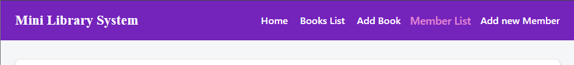
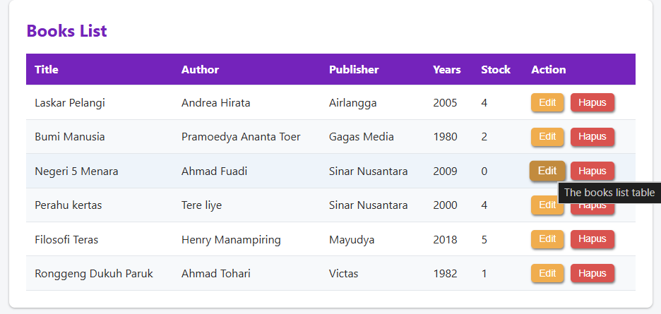
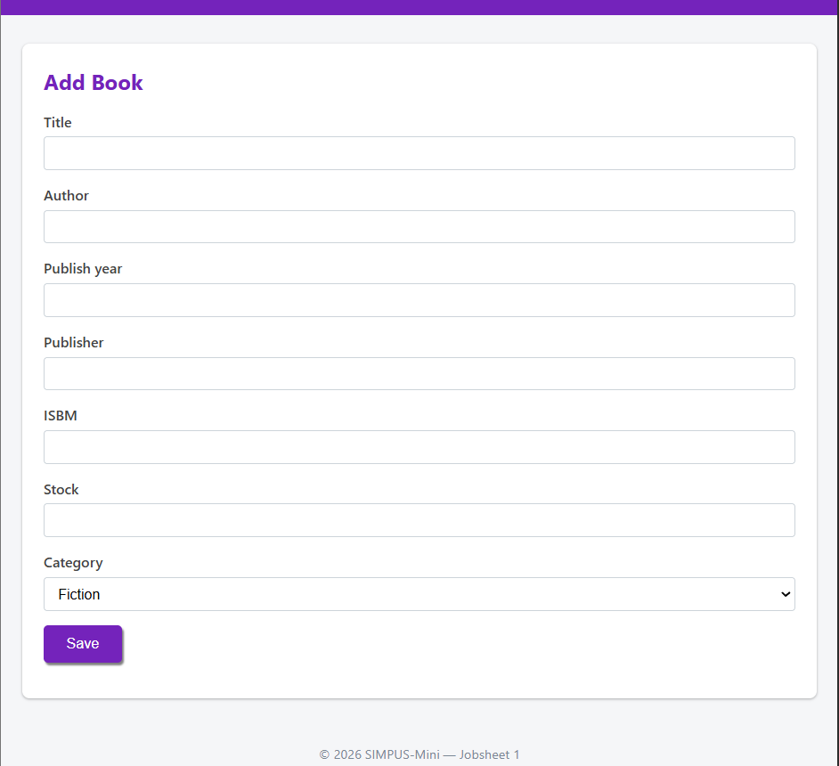

# Penjelasan Singkat
## Konsep yang Sering digunakan
1. CSS bisa dibuat bersamaan dalam satu halaman dengan file HTML ataupun hubungkan secara terpisah di file lain dengan mencantumkannya dalam tag ```<head>```
2. Padding dan margin, padding digunakan untuk memberi jarak antara konten dengan bordernya, sementara margin memberi jarak antara border dengan elemen lain di luarnya
3. Satuan yang sering digunakan dalam kode ini adalah rem, %, fr dan px(pixel). pixel bersifat absolut, rem dan % relatif
. Penggunaan warna, baik pada border dengan ```border-color```, atau untuk teks dengan properti```color```, kita dapat mengisinya dengan kode hex ataupun RGBA.
4. Transform dan transition berguna untuk menambahkan animasi sederhana,mengatur durasi, bentuk animasi, dan lain-lain
5. hover dan focus, selector khusus yang dijalankan ketika kursor diletakkan diatas elemen tersebut, focus dijalankan ketika elemennya diklik

## Navbar/header
Menggunakan model ```display:flex``` yang menyusun beberapa komponennya dalam satu baris horizontal. Animasi sederhana ditambahkan ketika menu di hover, transform 1.1 membuatnya seolah di zoom lebih dekat 



## Tabel 
Border default dihilangkan dengan ```border-collapse```, menggunakan style zebra (warna selang seling antara baris), dengan menggunakan selector nth-child(even) yang mengambil setiap baris genap dan memberinya warna yang berbeda.



## Form
Dibuat dengan lebar yang flexible menyesuaikan dengan parentnya (```widht:100%```).


