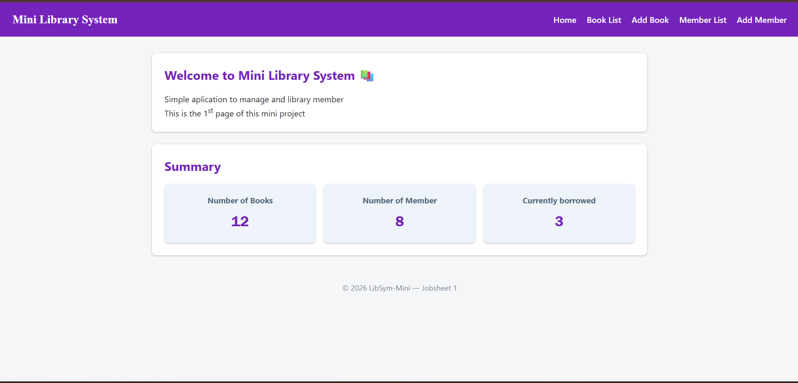
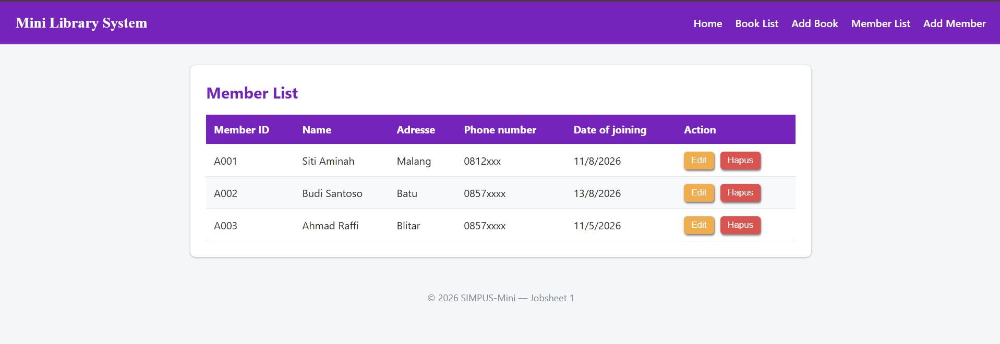
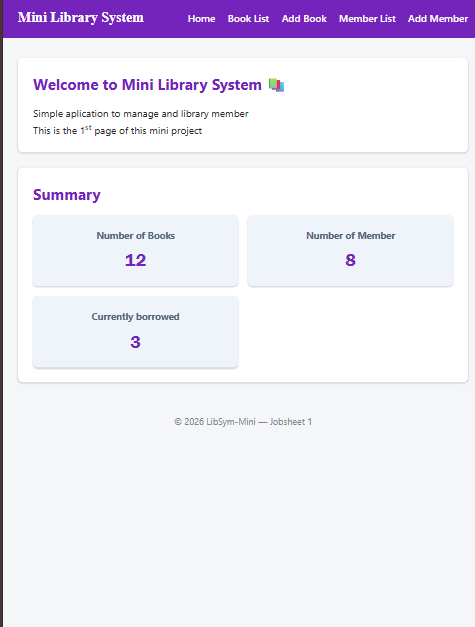
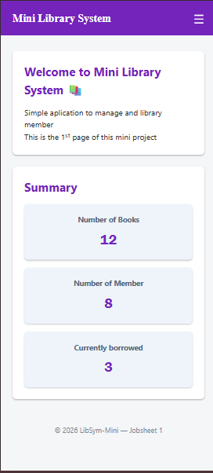
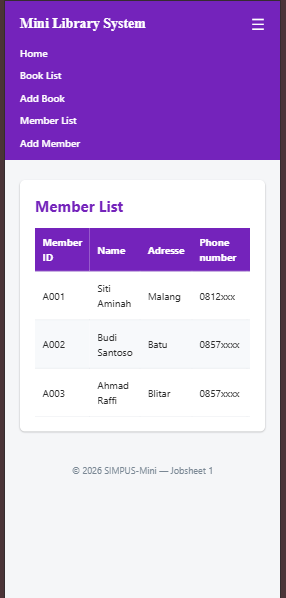

# Penjelasan Singkat
Halaman dibagi menjadi 3 layout (Mobile, Tablet, dan Desktop)
1. Pada layout awal yaitu dekstop, tampilan tetap sama seperti pada jobsheet 2





2. Namun pada layar dengan ukuran dibawah 768pixel (kebanyakan layar tablet) tampilan akan sedikit berubah menyesuaikan dengan lebar layar agar card tidak tampil dengan ukuran terlalu kecil



3. Penyesuaian paling terlihat pada layar mobile, dimana grid berubah menjadi 1 kolom saja, dan ukuran tabel yang terlalu lebar juga dibuat terpotong namun bisa di scroll. Ditambahkan juga humberger menu agar navbar tidak terlalu berhimpitan.





## Konsep yang Sering digunakan

- Pada dasarnya, perubahan yang terjadi disebabkan oleh kondisi ```@media (max-width:...px){ }```, yang membantu kita untuk menuliskan kode css yang hanya berlaku pada batas lebar layar tertentu

- Selector ```~``` yang digunakan untuk merujuk pada siblings (elemen lain dalam satu scoop yang sama)

